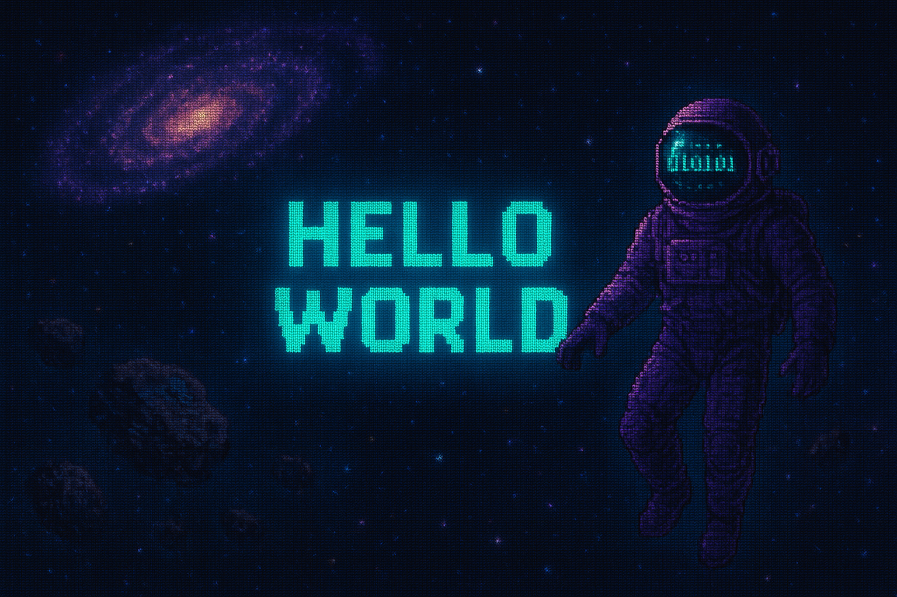

# 👋 ¡Hola! Soy Luz Elena Tovar Flores

 **Desarrolladora Full Stack Jr** | **Ingeniera en Sistemas** | **Desarrolladora de Software**

 ### ⭐ Apasionada por crear soluciones web seguras, escalables e inteligentes
 ### ⭐ Desarrollo aplicaciones end-to-end con arquitecturas modernas y mejores prácticas
 ### ⭐ Experiencia en desarrollo de aplicaciones web, desde el back-end hasta el front-end
 ### ⭐ Interés en IA y tecnologías emergentes

 ## 🛠 Tech Stack
### 💙 Lenguajes

### ⚛️ Frontend & Frameworks

### 🗄️ Bases de Datos

### 🔧 Herramientas

### 📈 GitHub Stats

<!-- Stats principales -->

  

<!-- Detalles del perfil -->

  

<!-- Serpiente -->

  

### 📫 Conectemos

⚡ "Comprometida con crear código que importe"

